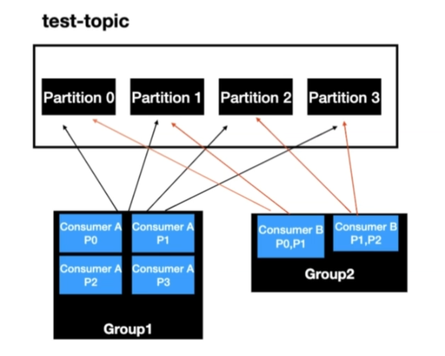

# Consumer Groups

Consumer Groups are used for scalable message consumption. Usually, each different application will have a unique consumer group.

Kafka Broker manages the consumer-groups acting as a Group Co-ordinator.

