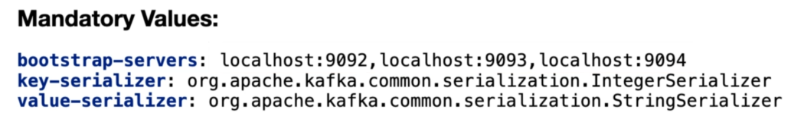

# Library Kafka Demo

> This is a demo based on the following Udemy's course: https://www.udemy.com/course/apache-kafka-for-developers-using-springboot

## Kafka Producer

### Creating project

1. Create a new Java 11 project using [Spring Initializr](https://start.spring.io/).
2. Add dependencies: Spring Web, Spring for Apache Kafka, Lombok, `org.springframework.boot:spring-boot-starter-validation`.
3. Enable `Compile` > `Annotations Processors` in IntelliJ.

### Configuration

* *KafkaTemplate* configuration (`resources/application.yml`)



* Setup for creating topics programatically using *Kafka Admin* (`com.learnkafka.config.AutoCreateConfig` and `resources/application.yml`)

> Make sure to have ZooKeeper and Kafka Brokers running locally, also validate topic creation from CLI.

* Setup default topic in `resources/application.yml` if you are going to use `KafkaTemplate.sendDefault()`.

```yml
  kafka:
    template:
      default-topic: library-events
```

### Project structure

* Create domain objects.
* Create a producer for domain objects that you want to trigger events with.
* Create a controller that uses producer for sending events.

### Testing

We'll separate unit tests from integration tests in our `build.gradle` file:

```
sourceSets {
	test {
		java.srcDirs = ['src/test/java/unit', 'src/test/java/intg']
	}
}
```

## Kafka Consumer

1. Create a new Java 11 project using [Spring Initializr](https://start.spring.io/).
2. Add dependencies: SDpring Data JPA, H2 Database, Kafka, Spring for Apache Kafka, Lombok, Spring Boot Starter Web
3. Enable `Compile` > `Annotations Processors` in IntelliJ.
