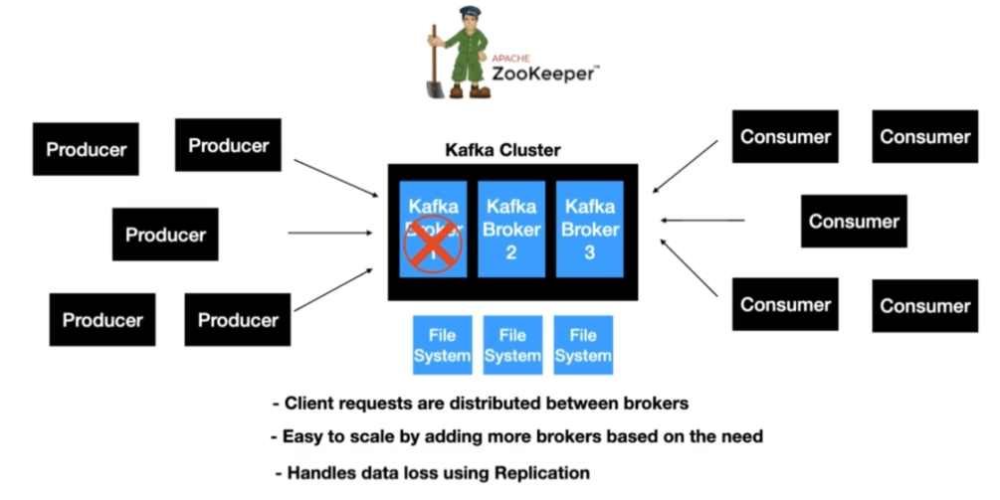
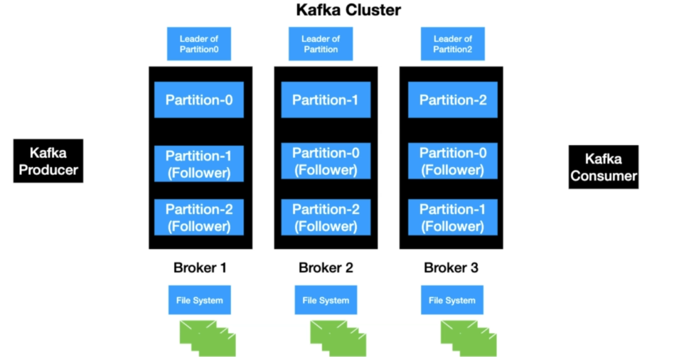
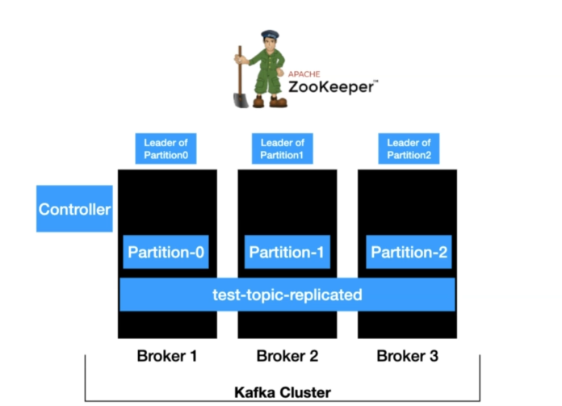
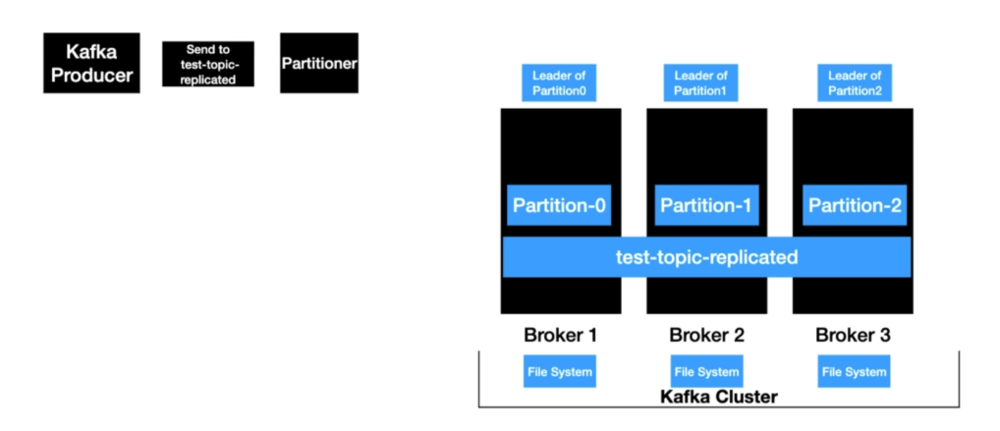
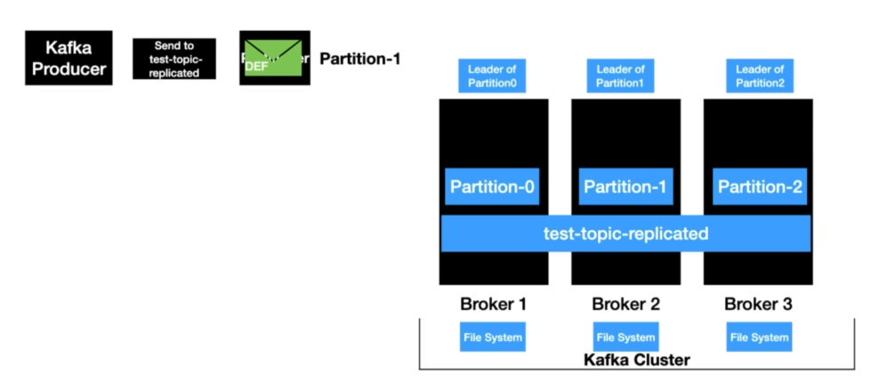
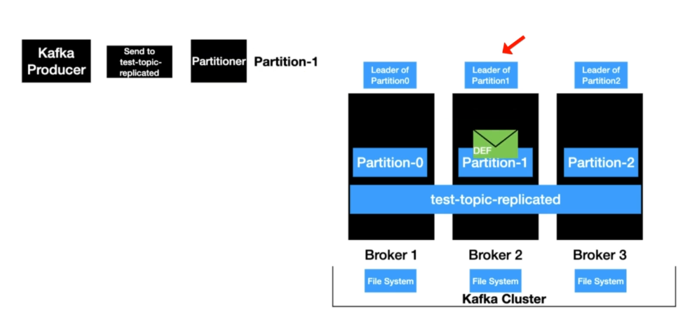
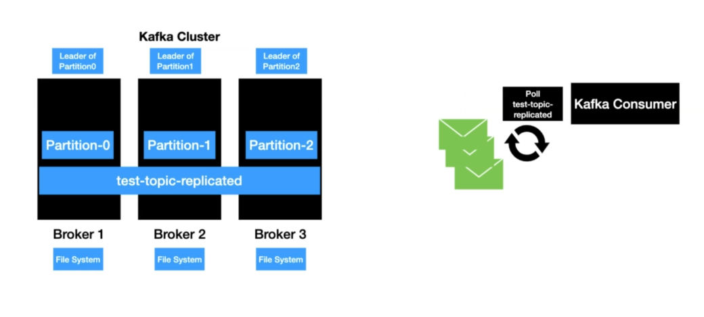
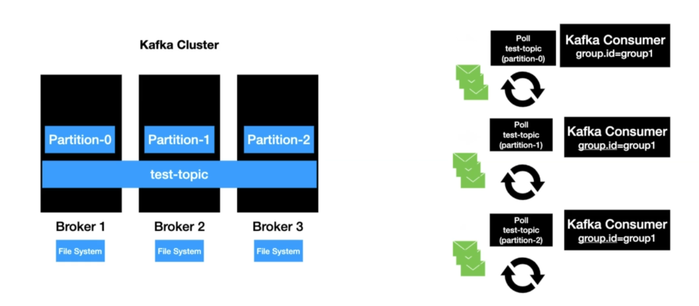

# Kafka as a Distributed System

* Distributing Client Requests
  * Leader/Follower Partitions
  * Consumer Offset Tracking & Group Coordinator
* Handling Data Loss

## Distributing Client Requests

### Leader/Follower Partitions

> Each partition has one server which acts as the "leader" and zero or more servers which act as "followers". The leader handles all read and write requests for the partition while the followers passively replicate the leader. If the leader fails, one of the followers will automatically become the new leader. Each server acts as a leader for some of its partitions and a follower for others so load is well balanced within the cluster. - [Kafka Docs](https://kafka.apache.org/documentation/#intro_distribution)

Every partition has exactly one **partition leader** which handles all the read/write requests of that partition. If replication factor is greater than 1, the additional partition replications acts as partition followers.

Kafka guarantees every partition replica resides on a different broker, so maximum replication factor is the brokers number.

Every **partition follower** is reading messages from the partition leader (acts like a kind of consumer) and does not serve any consumers of thar partition (only the partition leader does). Partition follower is considered in-sync if it keeps reading data from the partition leader without lagging behind and without losing connection to *ZooKeeper* (max lag defualt is 10 seconds and ZooKeeper timeout is 6 seconds, they are both configurable).

When a partition leader shuts down for any reason (actually, the broker it resides in shuts down), one of it's **in-sync partition followers/replicas** becomes the new leader.

### Consumer Offset Tracking & Group Coordinator

Kafka Consumer tracks the maximum offset it has consumed in each partition and has the capability to commit offsets so that it can resume from those offsets in the event of a restart.

Kafka provides the otpion to store all the offsets for a given consumer group in a designated Broker (for thar group) called the **Group Coordinator**. The consumer can then proceed to commit or fetch offsets from the coordinator broker.

> There's a special compacted Kafka topic named `__consumer_offsets` for processing `OffsetCommitRequest`.

The Brokers periodically compact the offsets topic since it only needs to maintain the most recent offset commit per partition. The coordinator also caches the offsets in an in-memory table in order to serve offset fetches quickly.

---

## Handling Data Loss

Kafka handles this through *Replication*. By setting *replication factor* higher than zero, some Brokers will behave as leaders of some partitions while working as followers for others as well. This way, partition followers will passively replicate the partition leader and will be ready in case of a failure.

---

## Example

### Kafka Producer

### Kafka Consumer

If there's a single Consumer, it will poll from all Partitions.

If there's a Consumer Group, polling will be splitted for scalability.

