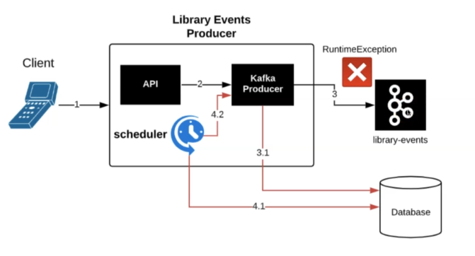
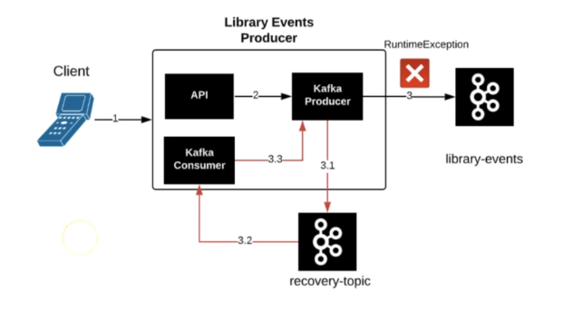

# Retain/Recover Failed Records in Kafka Producer

## Approach 1

1. You need to store the failed records.
2. A Scheduler will pull faile records and retry to publish them.

## Approach 2

Instead of using a database to persist failed records, you can use a `recovery-topic` to *"re-publish"* the failed records through a specific Kafka Consumer than can handle feeding back the record into a Producer.
