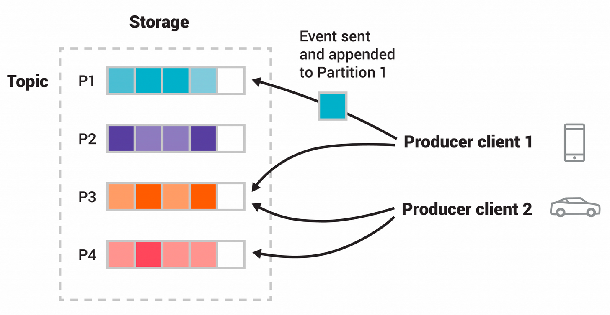

# Kafka: Topics

## Overviews

Events are organized and durably stored in **topics**. Very simplified, a topic is similar to a folder in a filesystem, and the events are the files in that folder.

Topics in Kafka are always *multi-producer* and *multi-subscriber*: a topic can have zero, one, or many producers that write events to it, as well as zero, one, or many consumers that subscribe to these events.

Events in a topic can be read as often as needed, they are not deleted after consumption. Instead, you define for how long Kafka should retain your events through a **per-topic configuration setting**, after which old events will be discarded.

> Kafka's performance is effectively constant with respect to data size, so storing data for a long time is perfectly fine.

To make your data fault-tolerant and highly-available, **every topic can be replicated**, even across geo-regions or datacenters, so that there are always multiple brokers that have a copy of the data just in case things go wrong, you want to do maintenance on the brokers, and so on.

> Replication is performed at the level of topic-partitions.

## Partitions

Topics are **partitioned**, meaning a topic is spread over a number of *"buckets"* located on different Kafka Brokers. This distributed placement of your data is very important for scalability because it allows client applications to both read and write the data from/to many brokers at the same time.

When a new event is published to a topic, it is actually appended to one of the topic's partitions. Events with the same event key (e.g., a customer or vehicle ID) are written to the same partition, and Kafka *guarantees* that any consumer of a given *Topic-Partition* will always read that partition's events in exactly the same order as they were written.

> Events with the same key (denoted by their color in the figure) are written to the same partition. Note that both producers can write to the same partition if appropriate.
