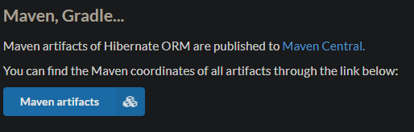
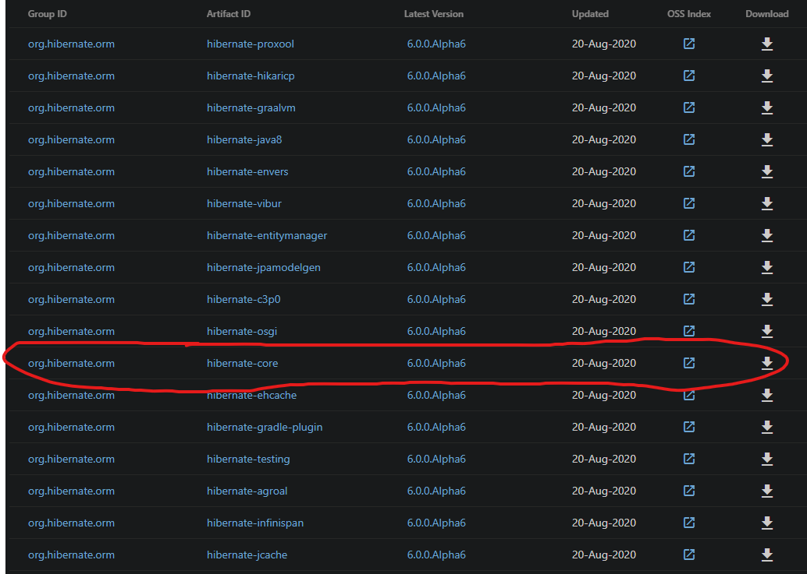
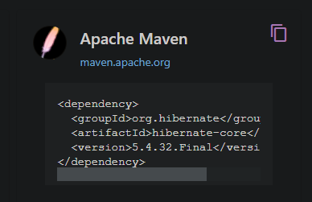

# Dependency Coordinates

> Visit project page or http://search.maven.org

As an example, we'll find Maven Coordinates for **hibernate-core**.

From the [project page](http://hibernate.org/orm/releases/), if you go to a particular release we can see the following:

And if we go to Maven Repositories...

We can also look for other versions: https://search.maven.org/artifact/org.hibernate/hibernate-core

If we select a version, we'll see the *Apache Maven* **GAV** that we need to copy and place in your `pom.xml` file.

