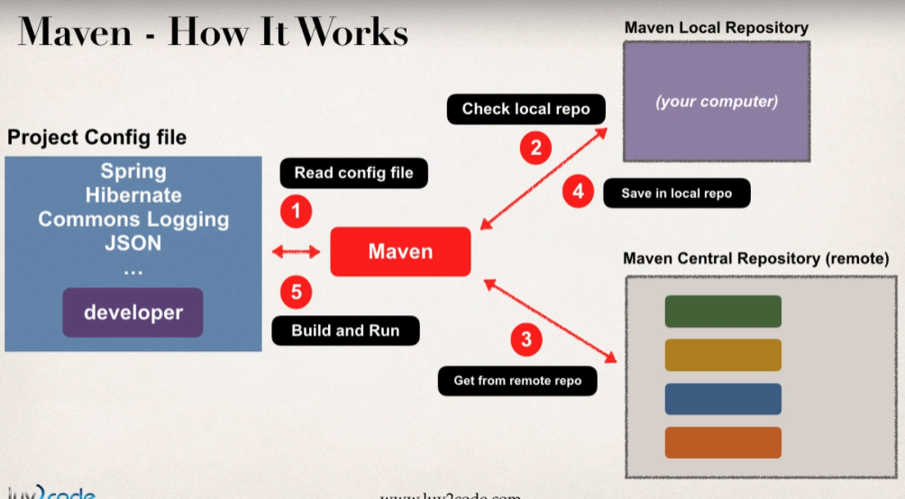

# Maven Overview

> [Apache Maven](https://maven.apache.org/) is a software project management and comprehension tool for Java-based projects. Based on the concept of a *Project Object Model (POM)*.

* Objectives
  * Making the build process easy
  * Providing uniform build system
  * Providing quality project information
  * Encouraging better development practices

## Objectives

Maven's primary goal is to allow a developer to comprehend the complete state of a development effort in the shortest period of time.

### Making the build process easy

> Maven works as a *Dependency Management* tool too, building and running with required dependencies.

While using Maven doesn't eliminate the need to know about the underlying mechanisms, Maven does shield developers from many details.

### Providing a uniform build system

Maven builds a project using its *POM* and a set of plugins. Once you familiarize yourself with one Maven project, you know how all Maven projects build. This saves time when navigating many projects.

### Providing quality project information

Maven provides useful project information that is in part taken from your *POM* and in part generated from your project's sources. For example:

* Change log created directly from source control
* Cross referenced sources
* Mailing lists managed by the project
* Dependencies used by the project
* Unit test reports including coverage

### Providing guidelines for best practices development

Maven aims to gather current principles for best practices development and make it easy to guide a project in that direction.

For example, specification, execution,a nd reporting of unit tests are part of the normal build cycle using Maven. Current guidelines:

* Keeping test source code in a separate, but parallel source tree.
* Using test case naming conventions to locate and execute tests.
* Having test cases setup their environment instead of customizing the build for test preparation.
* Some opinionated guidelines on how to layout your project's directory structure.
