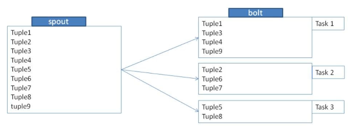
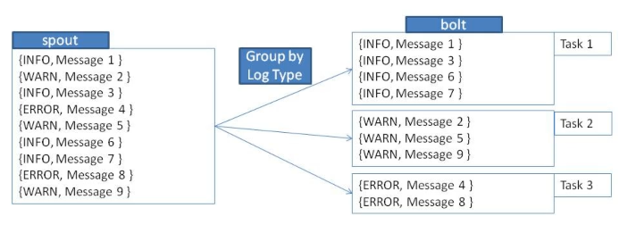
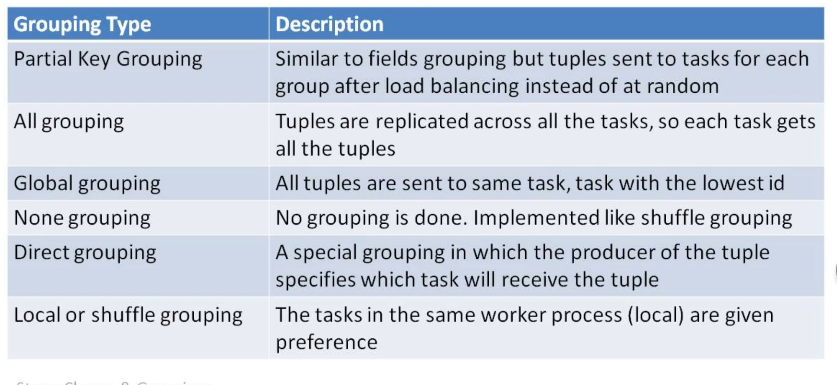

# Bolt Parallelism

Number of bolt tasks can be set while adding while adding a bolt to a topology: `topologyBuilder.setBolt("printBolt").setNumTasks(4)`. This would run four "printBolts" in parallel.

## Stream grouping

When multiple bolts run in parallel, the input stream has to be partitioned. Storm has eight built in groupings to decide how to partition:

1. Shuffle grouping
2. Fields grouping
3. Partial key grouping
4. All grouping
5. Global grouping
6. None grouping
7. Direct grouping
8. Local or Shuffle Grouping

### Shuffle Grouping

### Fields Grouping

### Other groupings

