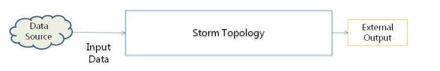
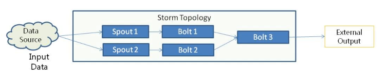
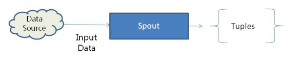
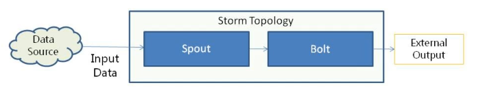

# Data Model

* Overview
* Tuples
* Streams
* Topology

## Overview

* Basic unit of data in Storm is **tuples**.

* All data coming into Storm is processed as *Unbounded Streams*.

* Streams consist of tuples.

## Tuples

> `Fields`, `Values`, `Tuple`

Tuples are the basic unit of data in Storm, and consists of an **ordered list of named fields**.

```
(name: "John", id: 100)
```

> Tick Tuples (empty tuples) can be configured to be send periodically to bolts (set `TOPOLOGY_TICK_TUPLE_FREQ_SECS`) so a bolt can take an specific action every certain amount of time (e.g, saving the number of tuples processed to database). 

```java
// Tick Tuples

config.put(config.TOPOLOGY_TICK_TUPLE_FREQ_SECS, 1);

if (TupleUtils.isTick(tuple)) { ... }
```

## Streams

* Streams are unbounded sequence of tuples.

* Storm can handle multiple streams at a time.

* Each stream **has a single type of tuple** and an **unique id**.

* Storm gets input data that is processed as streams.

* Tuples in streams can be processed in parallel.

```java
declarer.declareStream("streamRET", allFields);

declarer.declare(new Fields("logData", ...));

Integer serialNumber = tuple.getInteger();

String key = tuple.getStringByField("key");
```

## Topology

> `TopologyBuilder`: `setSpout`, `setBolt`, `createTopology`.
> `SpoutDeclarer` and `BoltDecarer` objects can be used to set spout and bolt properties.

* Represents the processing of data within Storm.

* Consists of interconnected components: **Spouts** and **Bolts**.

* A Topology is submitted to Storm *Nimbus* process.

* A Topology is an *Acyclic Graph of Storm Components (Spouts and Bolts)*.





```java
public class myMain {

  builder.setSpout(...)

  builder.setBolt(...)
    .shuffleGroping(...)

  LocalCluster cluster = new LocalCluster();

  StormSubmitter.submitTopology(...);
}
```

### Spout

> * `IRichSpout`: `Open()`, `nextTuple()`, `declareOutputFields()`, `ack()`, `fail()`.
> * `BaseRichSpout`: `Open()`, `nextTuple()`, `declareOutputFields()`.

* Entry point for data in Storm topology. Spouts get data from external sources and distribute data as tuples to bolts.

* Used to **convert input data into stream(s) of tuples**.

* A Spout can output multiple streams.

* Ready Spouts are available for popular data sources like Kafka.



```java
public class readerSpout extends BaseRichSpout {
  
  public void open(...) {...}

  public void nextTuple(...) {...}
}
```

### Bolt

> * `IRichBolt`: `prepare()`, `execute()`, `declareOutputFields()`, `ack()`, `fail()`, `cleanup()`.
> * `BaseRichBolt`: `prepare()`, `execute()`, `declareOutputFields()`.

* **Main data processing component** of Storm.

  * Consumes input tuples.

  * Transforms the tuple.

  * Outputs transformed tuple to another bolt or external system.

* A Bolt can process tuples from multiple streams.

* Ready bolts are available for popular data sources like Kafka, Hbase, Redis & Hive.



```java
public class printBolt extends BaseBasicBolt {
  
  public void prepare(...) {...}

  public void execute(...) {...}
}
```
