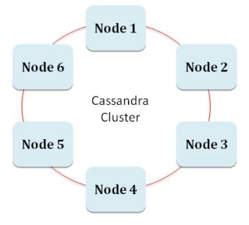

# External Interfaces

* Apache Kafka
* Cassandra
* Twitter

> There are other interfaces such as for Hadoop HDFS.

```java
KafkaSpout<String, String> kafka_spout = new ...

CassandraWriterBolt cassandra_bolt = new ...

tstream = new TwitterStreamFactory(...);
```

## Apache Kafka

* A special *Spout* for Kafka is used to get Kafka records for Storm processing.

* A special configuration class `KafkaSpoutConfig` is used to configure Kafka spout.
  * *Bootstrapservers*
  * *Topics*

* A `KafkaSpout<k,v>` class is used to create a consumer for Kafka.

### Kafka Example

```java
TopologyBuilder tp = new TopologyBuilder();

String Kafka_bootstrap = "127.0.0.1:9092";

String kafka_topic = "mytopic1";

Builder kafka_config = KafkaSpoutConfig.builder(kafka_bootstrap, kafka_topic);

KafkaSpout kafka_spout = new KafkaSpout<String, String>(kafka_config.build());

tp.setSpout("kafka_spout", kafka_spout, 1)

tp.setBolt("bolt", new myBolt()).shuffleGrouping("kafka_spout");
```

## Cassandra

* Apache Open Source No-SQL key-value database
* Highly fault tolerant (no SPOF)
* Highly available (Ring Architecture)
* Linearly scalable



The following properties can be set as part of Storm configuration:


### Writing to Cassandra table

1. Import the Cassandra interface library

```java
import org.apache.storm.cassandra.bolt.CassandraWriterBolt;

import static org.apache.storm.cassandra.DynamicStatementBuilder.*
```

2. Insert data from tuples to tables directly

```java
new CassandraWriterBolt(async(simpleQuery(
  "INSERT INTO Trades(tradeDate, ticker, tradeType, amount, price) VALUES (?, ?, ?, ?, ?);").with(fields("tradeDate", "ticker", "tradeType", "amount", "price"))));
```

## Interfacing with Twitter

The Twitter APIs in `twitter4j` (https://developer.twitter.com/en/apps) can be used to get tweets into Storm. A Twitter Spout can be created to get tweets.

### Getting Twits Example

1. In the Spout's `prepare` method:
   1. Setup authorization
   2. Create a listener for streaming data
   3. Add tweets in listener to a queue
   4. Create a twitter stream
   5. Add listener to the stream
   6. Create filter query to search for keywords
   7. Add filter to twitter stream
2. In the Spout's `nextTuple` method:
   1. Get tweets from the queue
   2. Emit the tweet as a tuple