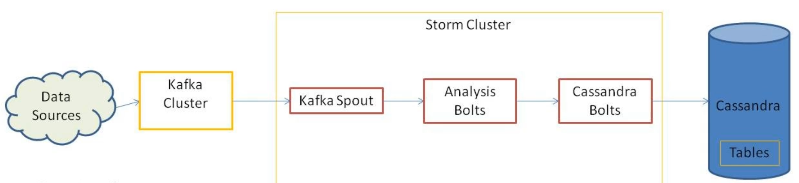

# Kafka-Storm-Cassandra

This stack form a *Real Time Stream Processing Platform*.

1. Kafka cluster receives data from multiple sources.
2. Storm Spouts receive the messages from Kafka topics.
3. Storm analyzes the data and summarizes the results.
4. Storm Bolts write the results to tables in Cassandra.

