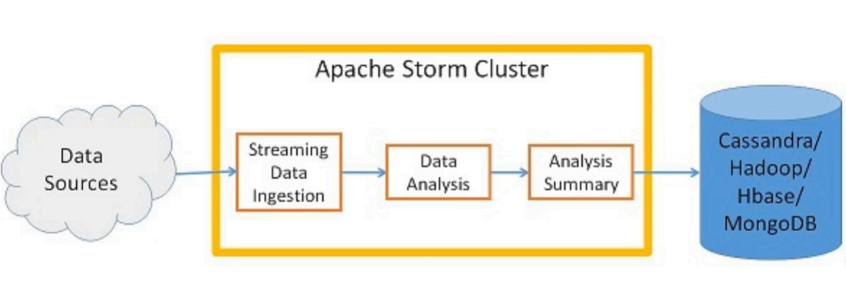

# Storm Overview

Apache Storm is a free and open source distributed stream processing (realtime) computation framework.

It uses custom created "*spouts*" and "*bolts*" to define information sources and manipulations to allow batch, distributed processing of streaming data.

> Apache Storm is a framework for processing big data in real time and integrates with queueing and database technologies you already use. Doing for realtime processing what Hadoop did for batch processing.

A Storm application is designed as a "*Topology*" in the shape of a *Directed Acyclic Graph (DAG)* with spouts and bolts acting as the graph vertices. Edges on the graph are named streams and direct data from one node to another. Together, **the topology acts as a data transformation pipeline**.

> At a superficial level, the general topology structure is similar to a `MapReduce` job, with the main difference being that data is processed in real time as opposed to in individual batches.

## Use Cases

* Realtime Analytics
* Online Machine LEarning
* Continuous Computation
* Distributed RPC
* ETL

### Examples

* Transport operator uses GPS data from vehicles to plan optimum delivery routes.
* IOT data from sensors is used to adjust various parameters.
* Mobile operators use location data from customers to present appropriate advertisements. ny intrusion attempts.
* Law enforcement agency uses real time twitter data to identify potential trouble makers during a riot.
* Power transmission company uses real time power usage data to route power supply.

## Features

* Real time stream processing
* Distributed system
* Fault-tolerant
* Horizontally scalable
* Guaranteed processing of data
