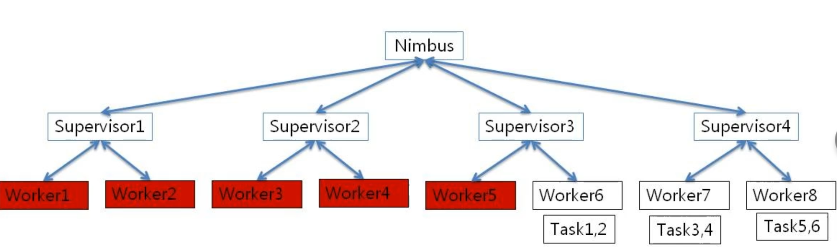

# Storm Scheduling

* Storm User Interface
* Storm Schedulers
  * Default
  * Isolation Scheduler
  * Resource Aware Scheduler
  * Resource Monitoring

## Storm UI

Storm UI is started by *Nimbus* and further configuration can be made in `storm.yaml`.

You can manage and monitor the following:

* Topologies
* Nimbus, supervisor and workers
* Topologies
* Acks, fails, and timeouts

## Storm Schedulers

Nimbus uses a scheduler to distribute the tasks.

### Default Scheduler

* Tasks are allocated at random to supervisors and workers.
* Tries to balance the load among nodes.



#### Default Configuration

Configuration set in `storm.yaml`.

```yaml
topology.component.resources.onheap.memory.mb: 512.0
topology.component.resources.offheap.memory.mb: 512.0
topology.component.cpu.pcore.percent: 10.0
topology.worker.max.heap.size.mb: 1024.0
```

### Isolation Scheduler

> Production topologies should not compete with other topologies.

Allocate topologies to nodes based on configuration set in `storm.yaml`

```yaml
storm.scheduler: org.apache.storm.scheduler.IsolationScheduler
isolation.scheduler.machines:
  "topology1": 10
  "topology2": 5
  ...
```

### Resource Aware Scheduler

Allocates tasks based on the available resources:

* Component level resource assignment.
* CPU and memory requirements can be specified in `storm.yaml`.

#### Configuration

```yaml
storm.scheduler: org.apache.storm.scheduler.IsolationScheduler
```

#### Spout/Bolt

In Spout/Bolt:

```java
setMemoryLoad(Number OnHeap, Number offHeap)
setCPULoad(Number amount) // 100 points corresponde to 1 CORE

// Example
setMemoryLoad(2048.0, 1024.0);
setCPULoad(10.0);
```

#### Limit at Worker Level

You can also **limit memory at worker level**, then heapsize allocated to workers for a topology can be globally controlled.

```java
Config conf = new Config();
Config.setTopologyWorkerMaxHeapSize(2048.0);
```

#### Limit at Node Level

You can limit resources at node level in `storm.yaml`.

```yaml
supervisor.memory.capacity.mb: [16000.0]
supervisor.cpu.capacity: [200.0]
```
