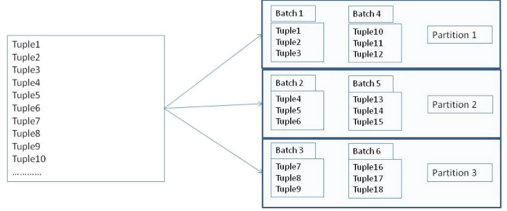
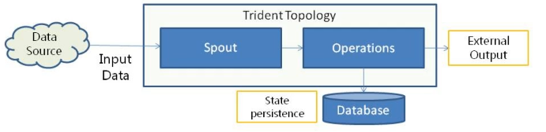

# Trident

* Trident Layer
  * Trident Streams
* Trident Processing
  * Transformations
  * State Processing
* Trident Operations

## Trident Layer

This layer is an extension to Storm that provides:

* Micro Batching of data
* Stateful Stream Processing
* Higher Level Abstractions on Stream:
  * Maps and Filters
  * Groups and Aggregates
  * Joins

### Trident Streams

* Trident stream is made up of tuples.
 
* Tuples are grouped into batches.

* Batches are distributed across partitions.

* Partitions are processed in parallel across nodes in the cluster.



## Trident Processing

* Spouts create the stream with tuples and batches in Trident.
* Different operations can be performed on the stream without defining a Bolt.
* An external database can be used for state persistence.



### Transformations

```java
public class myMain {

  public static class myFilter extends Base Filter { ... }

  public static class myMap implements MapFunction { ... }
  
  public static class myFunction extends BaseFunction { ... }

}
```

### State Processing

```java
public class myBackingMap implements IBackingMap ... {
  public List<T> multiGet(...);
  public void multiPut(...);
}
```

## Operations

* [Partition-local operations](./partition-aggregate)
* [Repartitioning operations](./repartitioning)
* [Aggregation operations](./aggregate)
* [Grouped streams operations](./grouped-streams)
* [Merges and Joins](./merges)

#### Case Study: Problem

An investment firm receives stock trading data of a customer as comma separated streaming data. This has to be processed to apply the following transformations:

1. Filter only BUY transactions.
2. Price has to be rounded to 2 decimal places.
3. Add a new column amount that is the product of price and quantity.
4. Print the results.

#### Case Study: Solution

1. Spout reads data in batches and converts to tuple.
2. A *Filter* is created to keep only BUY transactions.
3. A *Map* is created to round the price to 2 decimal places.
4. A *Function* is created to add a new column amount.
5. A *Peek* is created to print the tuple.
