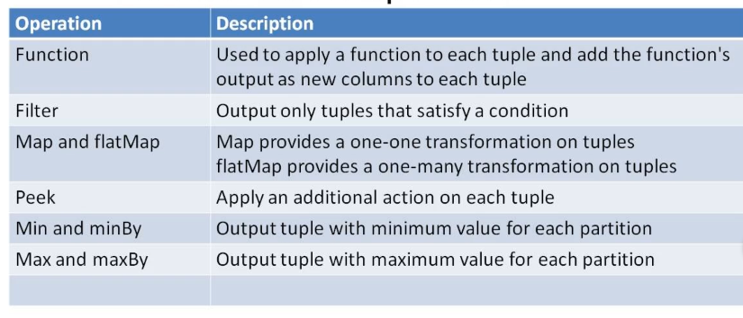

# Partition Aggregate

* Applied to tuples in each partition.
* Aggregtate values calculated for each partition.
* Input is replaced by the aggregate values.



There are three types of partition aggregates.

## 1. Combiner Aggregator

Three methods are defined: `init`, `combine` and `zero`.

```java
public class MaxVal implements CombinerAggregator<int> {
  public Int init(TridentTuple input) {
    return input.getInt(0);
  }

  public Int combine(Int val1, Int val2) {
    if (val1 > val2) return val1 else return val2;
  }

  public Int zero() { return 0; }
}
```

## 2. Reducer Aggregator

Two methods are defined: `init` and `reduce`.

```java
public class SumVal implements ReducerAggregator<Int> {
  public Int init() { return 0; }

  public Int reduce(Int val, TridentTuple tuple) {
    return val + tuple.getInt(0);
  }
}

myStream.partitionAggregate(new fields("valuue"), new SumVal(), new fields("sumVal"));
```

## 3. General Aggregator

Three methods are defined in the general aggregator: `init`, `aggregate` and `complete`.

```java
public class MinMax extends BaseAggregator<myState> {
  static Class myState { Int min = 0, max = 0; }o
  
  public myState init(Object batchId, TridentCollector input) { return new myState(); }

  public void aggregate(MyState state, TridentTuple tuple, TridentCollector collector) {
    Int currentVal = tuple.getInt(0);
    
    if (currentVal > state.max) state.max = thisVal;

    if (currentVal < state.min) state.min = thisVal;
  }

  public void complete(myState state, TridentCollector collector) {
    collector.emit(new Values(state.min, state.max));
  }
}

myStream.partitionAggregate(new fields("value"), newMinMax(), new fields("minval", "maxval"));
```